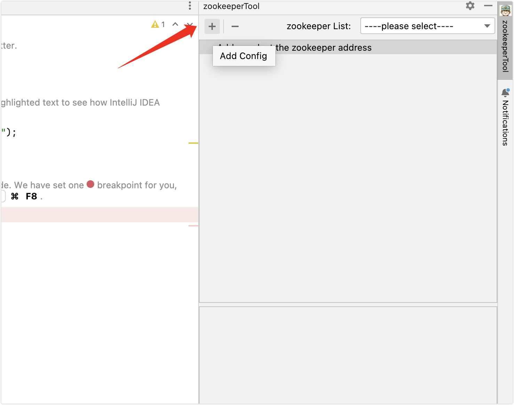
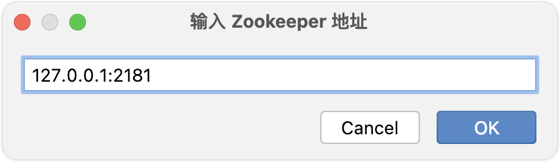
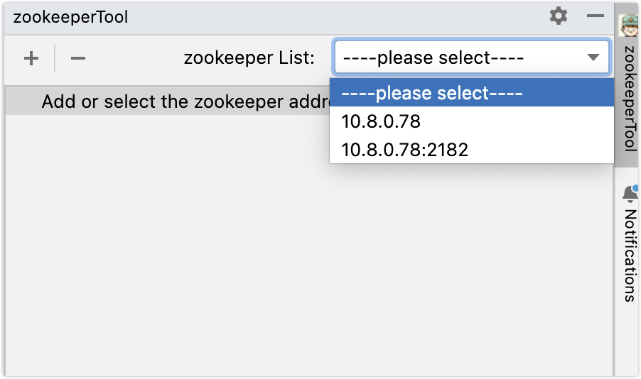
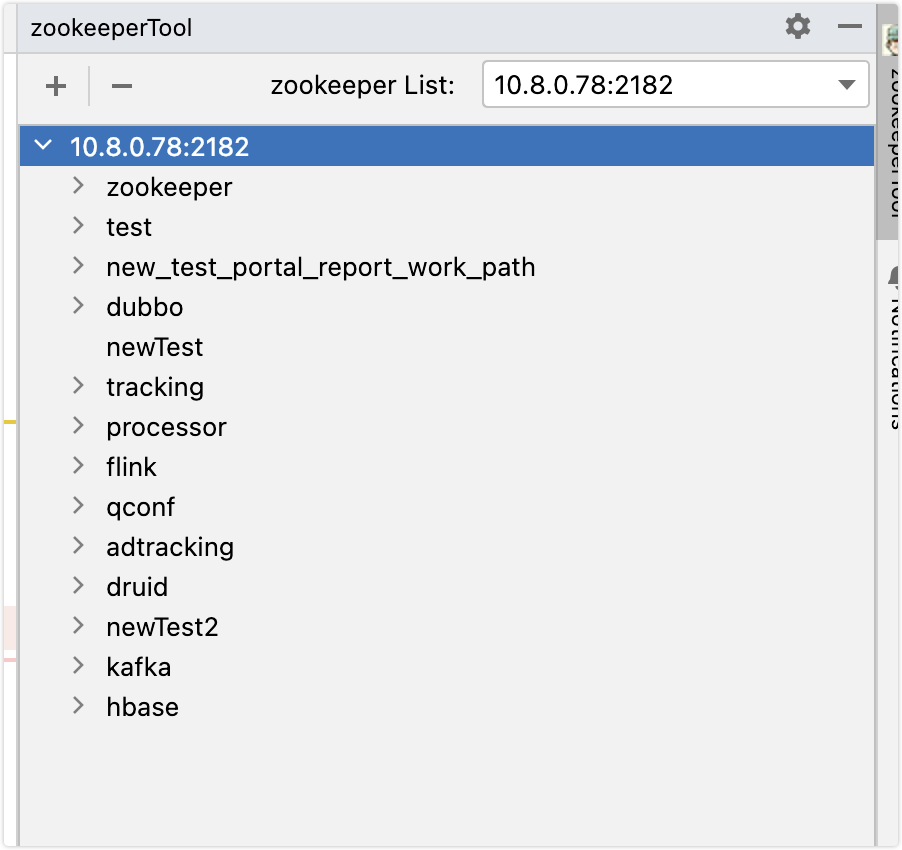
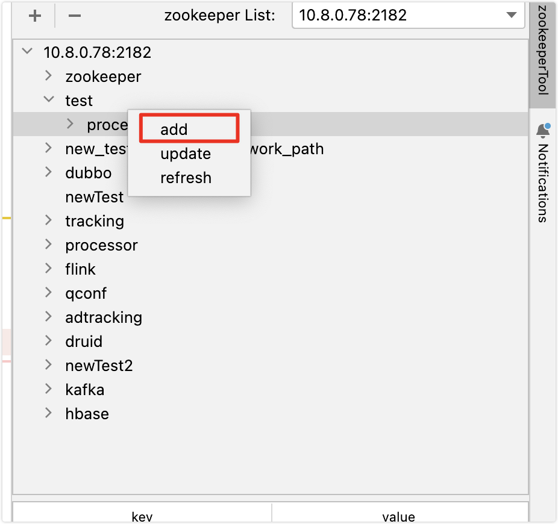
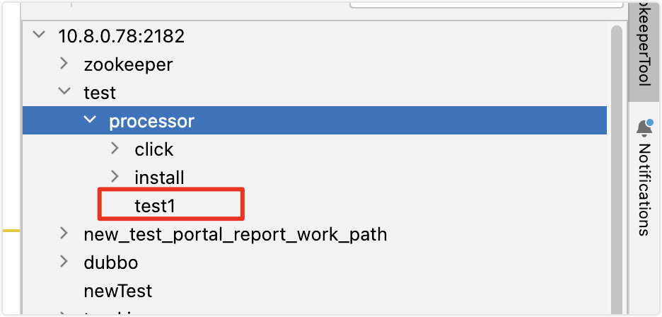
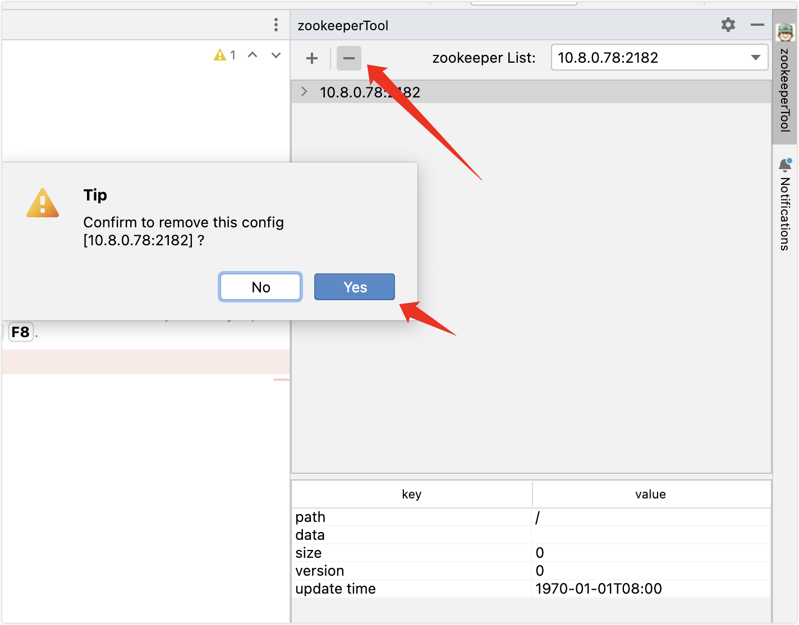

# idea-plugin-zk-client
zookeeper connection plug-in for idea

## 添加配置

### 点击添加配置

### 输入完整的zookeeper 地址

## 选择配置

### 在下拉列表中选中已配置的zookeeper地址

### 下面列表中，会自动展示选中的zookeeper数据

## 添加节点

### 在需要添加的路径下，点击【右键】，选择【add】

### 输入添加的节点信息，目前仅支持持久节点类型

- `path`为必填，`data`为选填

### 节点会自动添加到所选择路径下

## 删除节点、编辑节点

逻辑同添加节点

## 移除配置

点击下图中按钮，会移除当前选中的配置

