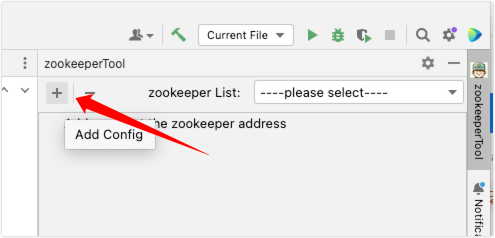
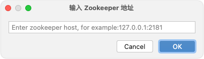
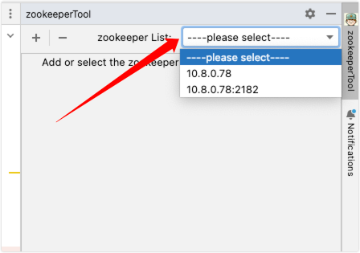
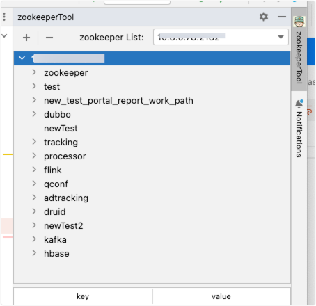
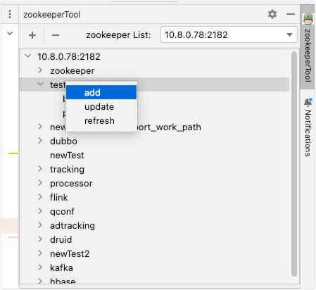
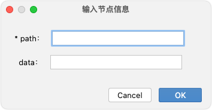
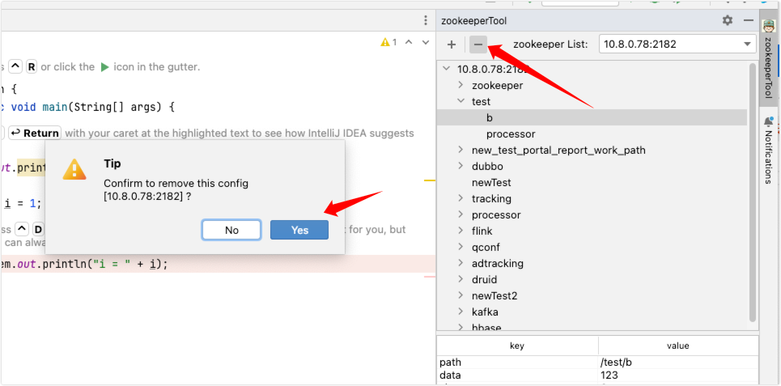

# idea-plugin-zk-client
> zookeeper connection plug-in for idea
>
> - Connects to the zookeeper service and supports clusters
> - View or edit node data.

## 添加配置

**点击添加配置**

**输入完整的zookeeper 地址**

## 选择配置

**在下拉列表中选中已配置的zookeeper地址**

**下面列表中，会自动展示选中的zookeeper数据**

## 添加节点

**在需要添加的路径下，点击【右键】，选择【add】**

**输入添加的节点信息，目前仅支持持久节点类型**

- **`path`为必填，`data`为选填**

## 删除节点、编辑节点

**逻辑同添加节点**

## 移除配置

**点击下图中按钮，会移除当前选中的配置**

